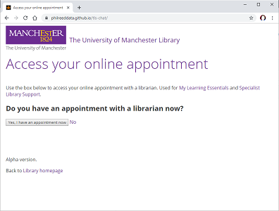
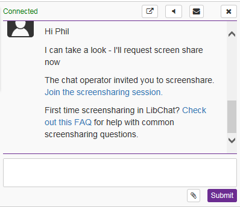
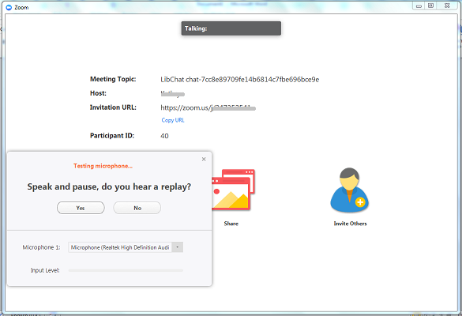
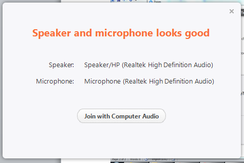
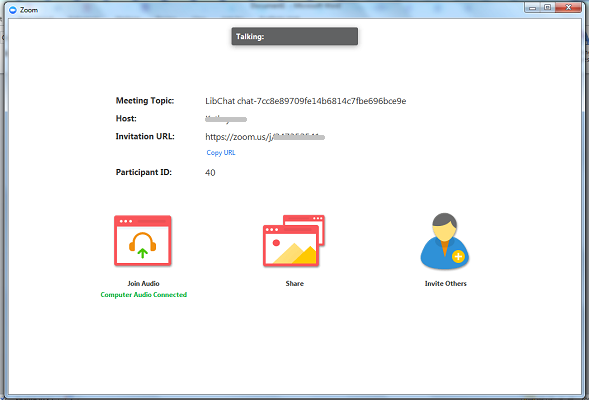
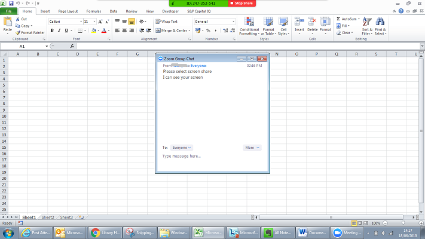
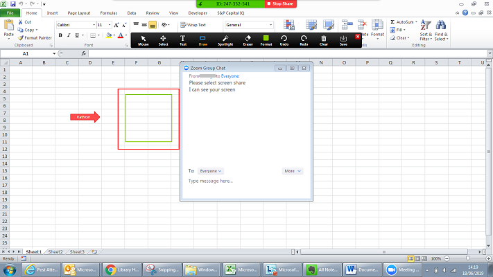
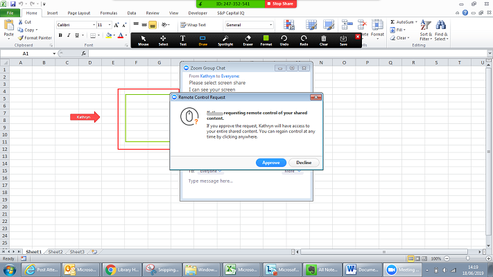
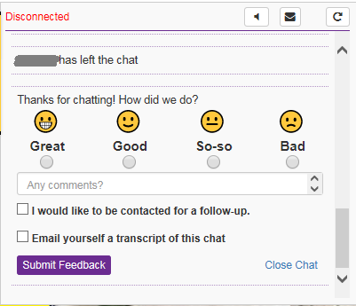

# Help using online appointments

If you have an enquiry with a member of library staff from the [My Learning Essentials](https://www.library.manchester.ac.uk/using-the-library/students/training-and-skills-support/my-learning-essentials/) or [Specialist Library Support](https://www.library.manchester.ac.uk/using-the-library/specialist-library-support/) teams, 
they may offer you an online appointment. 
The appointment will allow you to share screens, and communicate via audio or video.

* [What should I do before the online appointment?](#what-should-i-do-before-the-online-appointment)
* [How do I start the online appointment?](#how-do-i-start-the-online-appointment)
* [How do I connect my microphone and speakers/headphones?](#how-do-i-connect-my-microphone-and-speakersheadphones)
* [What else should I do at the start of the appointment?](#what-else-should-i-do-at-the-start-of-the-appointment)
* [The appointment has started; how can I share my screen?](#the-appointment-has-started-how-can-i-share-my-screen)
* [The appointment has started; how can I see my host’s screen?](#the-appointment-has-started-how-can-i-see-my-hosts-screen)
* [How do I end an online appointment?](#how-do-i-end-an-online-appointment)

## What should I do before the online appointment?

You will need to [install Zoom software](https://zoom.us/support/download) before the appointment. 
It is available for Windows, Mac, iOS and Android. 
The Windows version will work even if you do not have administrator rights. 
Any modern PC should work; please refer to 
[Zoom system requirements](https://support.zoom.us/hc/en-us/articles/201362023-System-Requirements-for-PC-Mac-and-Linux) 
for more details. 
The following guide applies to the Windows PC version.

It is possible to have an online appointment without installing the Zoom software beforehand. 
You will be offered to download the Zoom installer at the start of the appointment, however, to help maximise the appointment time, we recommend installing beforehand.

We recommend that you use **headphones and a microphone** on your PC or laptop. 
This will help you to hear clearly without producing audio feedback.

Please take care **not to share any sensitive or private data** with us,
be aware of what applications you have open such as email or un-anonymised patient data. 
We suggest you make a backup of any document that we may be working on with you before the appointment.

[ ^ back to contents](#help-using-online-appointments)

## How do I start the online appointment?

At the time of the appointment, use the link provided to 'access your online appointment'. Click the button ‘**Yes, I have an appointment**’ to see a chat box. 

In the ‘**Name**’ box, type your name. In the ‘**Name of librarian you have an appointment with**’ box, type the name of the librarian you are expecting to speak with.

Once you are connected, you will be invited to screenshare. Click the ‘**Join the screensharing session**’ link. We will come back to the Library Chat box after the screensharing session is finished; please keep this window open.

A new tab will open in your browser. If you have not installed Zoom, you will be offered to download the Zoom installer. You need to download and run this in order to continue. You may be asked to agree to Zoom’s terms of service and privacy policy. 

You may see a message ‘**Please wait for the host to start this meeting.**’ 

* The ‘host’ is the member of library staff you have an appointment with. 
* The ‘meeting’ is the online appointment.

The Zoom software will launch in a new window.

[ ^ back to contents](#help-using-online-appointments)

## How do I connect my microphone and speakers/headphones?

While you wait for the host to start the meeting, you can **test your computer audio**. Follow the instructions on screen. If you cannot get audio to work, type a message in the chat box to explain this. We may be able to continue the appointment via telephone call. 

 

After you have completed the audio test, you can click the ‘**Join with Computer Audio**’ button.

You should see a message ‘**Computer Audio Connected**’. The appointment can now begin.. 

You should be able to hear the host speaking. The host may also join with their webcam, in which case you will be able to see their face. There is no need for you to join with your webcam as well, unless you want to.

[ ^ back to contents](#help-using-online-appointments)

## What else should I do at the start of the appointment?

Before you share your screen, you can open the Chat area within Zoom to type messages or copy and paste text. (Note, this is separate to the Library Chat conversation.) 

Click on the ‘**Chat**’ icon in the black icon bar at the bottom of the screen to open the ‘**Zoom Group Chat**’ on the right of the screen. (If the black icon bar is not showing, move the mouse to the bottom of the screen to reveal it.)

At the start of the meeting, your audio may be muted. Click the ‘**Unmute**’ icon at the left of the black icon bar if there is one. If you have a ‘**Mute**’ icon, do not click this unless you want to mute yourself.

[ ^ back to contents](#help-using-online-appointments)

## The appointment has started; how can I share my screen?

**Make sure you have no confidential or sensitive data visible on your screen.** Click on the ‘**Share**’ icon at the bottom of the screen. You can choose to share your entire screen or a specific window (such as your browser, Word or Excel). **We recommend sharing the entire screen.** Click the ‘**Share**’ button.

When you start sharing your screen, the Zoom window is maximised. The black icon bar moves to the top of the screen. The chat box disappears; you can get it back by click on ‘**More**’ then ‘**Chat**’.

There are annotation tools that you or the host can use to highlight parts of your screen with boxes, arrows or lines.

Your host may ask to take control of your screen. This can be a useful way for them to help with whatever you need, such as fix your EndNote library, change your search details. When the host requests to take control of your screen, you will get a message; click the ‘**Approve**’ button if you agree.

[ ^ back to contents](#help-using-online-appointments)

## The appointment has started; how can I see my host’s screen?

Your host may share their screen with you. You will see it automatically when they choose to share it.
When they start sharing their screen, the Zoom window is maximised. The black icon bar moves to the top of the screen. The chat box disappears; you can get it back by click on ‘**More**’ then ‘**Chat**’.

If the host is using a webcam, their face will appear in a small window on the right. You can move this around the screen as required. 

[ ^ back to contents](#help-using-online-appointments)

## How do I end an online appointment?

When you have finished, you can leave the meeting by clicking on the red ‘**Leave Meeting**’ icon at the right of the black icon bar. You will be asked to confirm.

Once Zoom has closed, go back to the Library Chat window. After the host has left the chat, you will be asked to give feedback. You can choose to email yourself a transcript of the chat; please note, this will only include what was typed in the Library Chat window, not the Zoom window.

[ ^ back to contents](#help-using-online-appointments)
